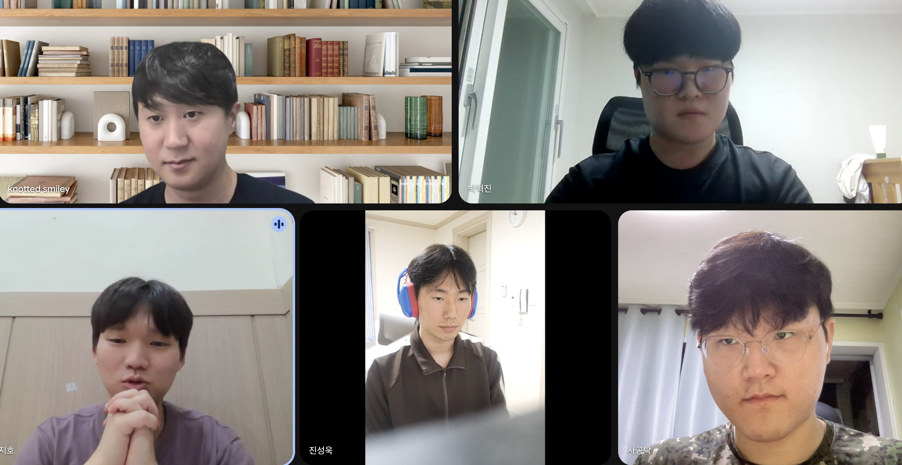
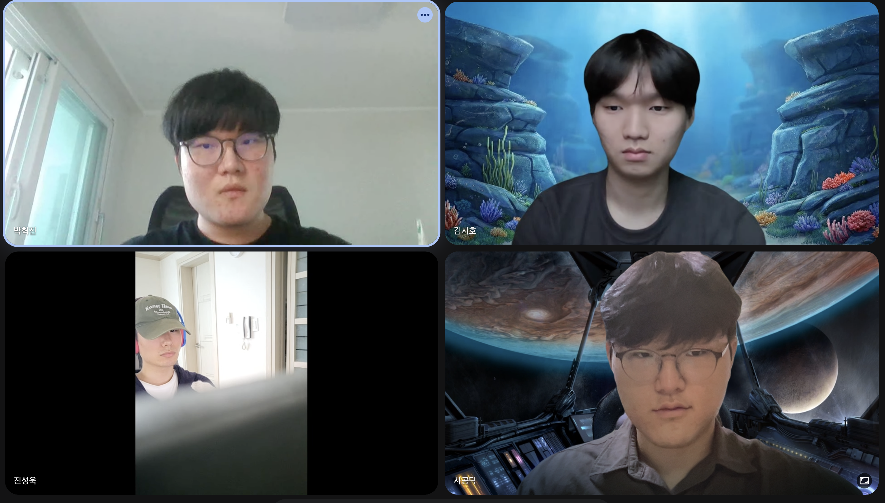
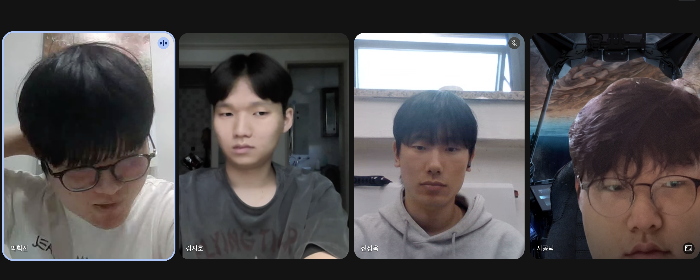

# 우리 조직을 소개합니다

### 👥 Team Members

| 프로필 | 닉네임 | 이름 | 학과 | GitHub | 역할 |
| :---: | :--- | :--- | :--- | :--- | :--- |
|  | **TakSakong** | 사공탁 | 컴퓨터학부 | [@TakSakong](https://github.com/TakSakong) | FE/BE, DevOps, 모델 평가 및 분석 |
|  | **kimbujang8** | 김지호 | 컴퓨터학부 | [@kimbujang8](https://github.com/kimbujang8) | 구매 담당자, 데이터 수집 및 임베딩, 정제 |
|  | **wooki0704** | 진성욱 | 컴퓨터학부 | [@wooki0704](https://github.com/wooki0704) | 파인튜닝 (LoRA) |
|  | **parkhj0206** | 박혁진 | 컴퓨터학부 | [@parkhj0206](https://github.com/parkhj0206) | 팀장, 학습 데이터 생성 |

---

## 📝 회의록 (Meeting Notes)

<b>📂 0910 회의록</b>

 

### 📌 프로젝트 역할 분담 및 진행 방향 논의
* **일시:** 2026년 9월 10일 (목)
* **참석자:** 혁진, 탁, 성욱, 지호 (총 4명)
* **안건:** 프로젝트 역할 분담, 진행 계획 수립, 멘토 피드백 준비

---

### 1. 주요 안건 및 논의 내용

#### 가. 멘토링 및 진행 현황
* **멘토 연락 상황:** 팀장(혁진)이 멘토에게 이메일/전화로 연락 완료. 멘토 측에서 교수님 확인 후 추가 안내 예정(금주 내 연락 대기).
* **진행 방안:** 멘토 확정 전까지 웹 서비스 개발을 전제로 사전 역할 분담 및 환경 구축 우선 진행.

#### 나. 프로젝트 개요 및 기술 스택
* **프로젝트명(안):**
  1. `클로바튜터` (사용 허가 시)
  2. `네잎클로바` - 당신의 대학 생활에 행운을…
* **주요 기능 구상:**
  * 수강신청 지원 기능 (에브리타임 수동 추가 불편 개선)
  * 강의계획서 기반 RAG (Retrieval-Augmented Generation) + LLM 결합 QA/학습 지원 기능
* **개발 형태:** 웹 서비스 우선 가정 (추후 멘토 협의를 통해 웹/앱 여부 확정)

#### 다. 역할 분담
* **AI (RAG/LLM):** 성욱, 혁진 *(지호: 프론트엔드 작업 완료 후 AI 파트 병행/합류 가능)*
* **백엔드 (Backend):** 탁
* **프론트엔드 (Frontend):** 지호

---

### 2. 향후 일정 및 과제 (To-Do List)

- [ ] **개발 환경 구축 (탁):** 프로젝트명 기반 GitHub Repository 생성 및 개발 작업 환경 구성
- [ ] **멘토 확인 사항 문의 (혁진):**
  - 서비스 형태 (웹 vs 앱) 확정
  - 인정 가능 정량실적 항목 확인 (논문, SW 등록, 사내 문서 등록 등)
- [ ] **정기 회의 일정:** 주 2회 진행 (화요일/목요일 중 1회는 멘토 미팅, 1회는 팀 자체 회의)
- [ ] **발표자 선정:** 총 5회 발표 중 1차 발표 및 추가 1회는 팀장(혁진) 담당, 그 외 회차는 발표 시점에 맞춰 사전 결정

---

### 3. 기타 사항
* 참석자 단체 사진 촬영 완료
* 다음 회의는 멘토 연락 수신 후 세부 요구사항 구체화 예정

<b>📂 0917 회의록</b>

 

### 📌 프로젝트명 확정 및 세부 기술 스택 / 역할 분담 논의
* **일시:** 2026년 9월 17일 (목)
* **참석자:** 혁진, 탁, 성욱, 지호
* **안건:** 프로젝트명 확정, 세부 역할 분담, 데이터 수집/파인튜닝/배포 구체화, 멘토 미팅 및 발표 일정 정리

---

### 1. 주요 안건 및 논의 내용

#### 가. 프로젝트명 확정
* **프로젝트명:** `네잎` (영문: `four-leaf`)

#### 나. 세부 역할 분담 및 기술 스택
* **데이터 수집 및 VectorDB (지호):**
  * 데이터 크롤링 및 수집, 청킹(Chunking), ChromaDB 저장
  * 수집 대상 데이터: 에브리타임 강의평가, 강의계획서, 경북대 공식 홈페이지 공지사항
* **학습 데이터셋 구축 및 품질 관리 (혁진):**
  * 수집 데이터를 기반으로 생성형 AI 활용 파인튜닝 데이터셋 10만 개 생성 및 준비
  * **LLM-as-a-Judge** 방식을 채택하여 생성된 데이터셋의 퀄리티를 자동 평가/유지하는 AI 가드레일 배치
* **모델 파인튜닝 (성욱):**
  * A100 GPU 서버 환경에서 Llama 3 8B 모델 파인튜닝 진행
  * LoRA 및 QLoRA 기법 활용
* **풀스택 및 인프라 / 모델 평가 (탁):**
  * **Frontend & Backend:** 웹 서비스 풀스택 개발
  * **DevOps & 배포:** Docker 및 AWS 기반 웹 서비스 배포, Modal Serverless 활용 AI 모델 배포
  * **모델 평가 및 분석:** 파인튜닝 모델 성능을 다양한 정량/정성 평가 방식을 통해 비교 분석

#### 다. 협업 규칙 및 진행 방향
* GitHub 기반 협업 규칙 준수 및 각자 파트 개발 진행
* 개발 진행 중 도움이 필요한 이슈 발생 시 팀원 간 유기적 지원

#### 라. 정량 실적 목표
* 학술 논문 작성을 최우선 포커스로 설정 및 준비

---

### 2. 향후 일정 및 과제 (To-Do List)

- [ ] **각 담당 파트 개발 착수:**
  - [ ] 지호: 에타/공지사항 크롤러 작성 및 ChromaDB 파이프라인 구축
  - [ ] 혁진: 10만 개 학습 데이터 생성 파이프라인 & LLM-as-a-Judge 구축
  - [ ] 성욱: A100 서버 파인튜닝 환경 세팅 및 Llama 8B LoRA / QLoRA 실험
  - [ ] 탁: spring boot / react / FastAPI 프로젝트 초기 세팅, Dockerfile 작성 및 Modal 배포 파이프라인 준비, github actions CI/CD 구축
- [ ] **멘토 미팅 일정:** 2주마다 일요일 저녁 이후 진행
- [ ] **발표자 선정:** LMS 발표 공지 확인 후 순차적으로 돌아가며 진행

---

### 3. 기타 사항
* 전원 회의 참석 완료
* 차기 멘토 미팅 준비 및 파트별 개발 진행 현황 공유 예정

<b>📂 0920 회의록</b>

 

### 📌 멘토 피드백 반영, PPT 발표 준비 및 개발 현황 점검
* **일시:** 2026년 9월 20일 (일)
* **참석자:** 혁진(팀장), 탁, 성욱, 지호 (전원 참석)
* **안건:** 멘토링 피드백 과제 수행 방안 및 역할 분담, PPT 공용 드라이브 작업 방식 결정, 발표자/발표 순서 정하기, 클라우드 배포 스택 최종 확정(AWS), 파트별 개발 현황 공유

---

### 1. 주요 안건 및 논의 내용

#### 가. 멘토링 피드백 대응 및 PPT 발표 과제 준비
* **작업 방식:** 구글 공용 드라이브 계정을 활용해 PPT 공동 작업 및 발표 준비 진행 (디자인보다 **내용의 구체성**을 최우선으로 작성)
* **발표자 선정 규칙:** 발표는 고정된 발표자 없이 **주제 및 발표 내용에 따라 팀원 모두가 번갈아가면서 진행**하기로 결정

#### 나. PPT 주요 구성 과제 (멘토 요청사항)
1. **대학 현장 고충 조사:** 실제 대학 현장 내 교육/학습 고충 정리
2. **조사 방법론 수행:**
   * **데스크 리서치:** 설문지(학생/교수 대상) 확보 및 타 에듀테크 서비스 조사 자료 활용
   * **인터뷰:** 포커스 그룹 인터뷰(FGI) 및 1:1 인터뷰 진행
3. **핵심 문제점 및 인사이트 5가지 정의:**
   * **문제점 1:** 실시간 질의응답의 어려움 (학생)
   * **문제점 2:** 전체 학생 케어의 한계 (교수)
   * **문제점 3:** 연구/특수 수업 시 보안 환경 필요성
   * **문제점 4:** 반복 학습을 위한 퀴즈/요약/정리 지원 요구
   * **문제점 5:** 데이터 기반 커리어 관리 필요성
4. **문제 해결 방안 (매핑):**
   * 기존 에듀테크 서비스 주요 기능 조사
   * 정의한 5가지 문제점과 연계 가능한 해결책 1:1 매핑 정리
5. **'네잎' 서비스 주요 경쟁력 및 비즈니스 모델:**
   * 전체 기능 정리 및 타 에듀테크 대비 **핵심 차별점 3~4가지** 도출
   * SaaS 형태 유지를 위한 **구독형 비즈니스/비용 모델** 수립
   * **기술적/사업적 확대 방안:** 연도별 타겟 시장, 계정 취합 목표, 기술 고도화 로드맵 작성

#### 다. 배포 인프라 스택 변경
* **기존 안:** 네이버 클라우드 지원 시 적용 예정
* **최종 확정:** 지원 여부와 관계없이 **AWS(Amazon Web Services)**를 활용하여 안정적인 배포 진행

#### 라. 파트별 개발 현황 공유
* 각 담당자별(데이터 크롤링/ChromaDB, 학습 데이터셋 생성, Llama 파인튜닝, 백엔드/프론트엔드/DevOps) 현재 진행 상황 공유 및 상호 피드백 진행

---

### 2. 향후 일정 및 과제 (To-Do List)

- [ ] **공용 드라이브 PPT 작성 완료 (전원):** 2회차 수업 전까지 파트별 구체적 내용 기재
- [ ] **데스크 리서치 및 인터뷰 실시 (팀 전체):** 설문지 폼 작성 및 학생/교수 인터뷰 진행
- [ ] **AWS 배포 환경 세팅 (탁):** Docker / AWS 인프라 파이프라인 구성
- [ ] **발표 순서 및 담당 파트 정리 (전원):** 주제별 발표 담당자 매핑 및 사전 연습

---

### 3. 기타 사항
* 멘토 미팅 피드백 바탕으로 과제 요구사항 구체화 완료
* 팀원 간 유기적 과제 배분 및 개발 진행 지속

<b>📂 0923 회의록</b>

 

### 📌 설문조사/인터뷰 설계, 개발 현황 점검 및 지원비/수행계획서 논의
* **일시:** 2026년 9월 23일 (수)
* **참석자:** 혁진(팀장), 탁, 성욱, 지호 (전원 참석)
* **안건:** 학생 대상 설문지 문항 구성, 인터뷰/에듀테크 조사 역할 분담, 파트별 개발 진행 현황 점검, 논문 투고 및 지원비/교통비 예산 수립, 수행계획서 작성 담당 지정

---

### 1. 주요 안건 및 논의 내용

#### 가. 학생 대상 설문조사 양식 수립
* **인적 사항:** 개인정보 최소화를 위해 이름은 제외하고 **전공 및 학년**만 수집
* **고충 조사 문항 (객관식 복수 응답 + 기타 주관식):**
  * 수업 내용에 대한 이해 부족 (실시간 질의응답 어려움)
  * 대학 강의 자료의 방대함 및 요약 필요성
  * 족보/시험 정보 소유 여부에 따른 학습 난이도 편차
  * 진로/학업 상담 기회 부족
  * 저작권 문제로 인한 강의 자료 AI 활용 제한 등
* **기대 기능 및 배포:** 체크박스 형태 및 기타 의견 수록, Gemini/GPT 활용하여 설문 폼 세팅 후 에브리타임 등에 익명 배포

#### 나. 인터뷰 및 에듀테크 서비스 조사 계획
* **대면 인터뷰:** 팀원 1인당 **최소 학생 3명 + 교수 1명** 인터뷰 진행 (교수 인터뷰는 타 과 포함 가능)
* **에듀테크 조사:** 멘토 요청사항에 맞춰 팀원 1인당 **에듀테크 서비스 1개씩 조사** 후 다음 회의 때 비교 분석 및 차별점 도출

#### 다. 개발 현황 점검
* **데이터 수집/임베딩 (지호):** 
  * 경북대 공지사항 크롤링 진행 중 (수집 범위: 22학번 기준 고려하여 2021~2022년도 게시글까지 확정)
  * 강의계획서 PDF 파싱 및 ChromaDB 임베딩/저장 완료
* **프론트/백엔드/DevOps 및 AI 배포 (탁):** Next.js/FastAPI 세팅 완료, Docker 및 AWS 인프라 배포 준비 완료 CI/CD 구축 CI 작동 중, CD 는 꺼두었다가 실제 AWS 계정만들고 나서 진행, Modal 기반 모델 배포 파이프라인 구상, 프론트엔드, 백엔드 채팅 관련 요소들 개발완료.

#### 라. 사업비/지원비 사용 계획 및 논문 투고
* **논문 투고:** 학부생 논문 경진대회 및 한국정보과학회 학회 투고 검토 (투고비 약 5만 원 선 반영)
* **교통비 및 지원비:** 서울 미팅/발표 참석을 고려한 KTX/버스 교통비(왕복 기준 예산 편성) 및 온라인 구독 서비스(팀 계정 1개) 활용 계획 수립
* **수행계획서 작성:** 기존 신청서 내용 기반으로 **탁**이 담당하여 작성 (막히는 부분은 지호와 논의 및 다음 주 월요일 회의에서 최종 점검)

#### 마. 발표 및 멘토링 운영 방식
* **발표자 선정:** 고정 발표자 없이 **주제 및 회차별로 팀원 전원이 번갈아가며 진행**
* **멘토 미팅:** 2주마다 일요일 진행 원칙 유지 (필요시 서울 방문 미팅 병행)

---

### 2. 향후 일정 및 과제 (To-Do List)

- [ ] **에듀테크 서비스 1인 1개 조사 및 PPT 작성(전원):** 다음 주 회의 전까지 분석 완료
- [ ] **대면 인터뷰 실시 (전원):** 1인당 학생 최소 3명 + 교수 1명 인터뷰 진행
- [ ] **설문지 배포 (탁):** 익명 설문 폼 완성 후 에타 및 학생 커뮤니티 공유
- [ ] **중간발표 1 발표준비 (탁):** PPT 제작 및 발표 준비
- [ ] **수행계획서 및 지원비 사용계획서 작성 (혁진):** 다음 주 수요일 마감 전 작성 및 단톡방 공유
- [ ] **공지사항 크롤링 마무리 및 벡터화 (지호):** 2021~2022년도 게시물 수집 및 ChromaDB 저장 완료
- [ ] **차기 팀 회의:** 다음 주 월요일 (식사 및 수행계획서/조사 내용 최종 점검)

---

### 3. 기타 사항
* 지원금 신청서 및 학과 관련 서류 절차 진행 상황 공유 완료

<b>📂 1001 회의록</b>

 

### 📌 회의 주제 작성
* **일시:** 2026년 10월 1일 (목)
* **참석자:** 
* **안건:** 

---

### 1. 주요 안건 및 논의 내용

#### 가. 주요 항목 1
* 

#### 나. 주요 항목 2
* 

---

### 2. 향후 일정 및 과제 (To-Do List)

- [ ] **할 일 1:** 
- [ ] **할 일 2:** 

---

### 3. 기타 사항
* 

<b>📂 1008 회의록</b>

 

### 📌 RAG 파이프라인 현황 점검, 데이터셋 공동 생성 전략 및 멘토 미팅 일정 논의
* **일시:** 2026년 10월 8일 (목)
* **참석자:** 혁진(팀장), 탁, 성욱, 지호 (전원 참석)
* **안건:** RAG 구축 현황 공유, LLM API 제한에 따른 데이터셋 분산 생성, 모델 파인튜닝/평가 세부 계획, 교수자 화면 구현, 멘토 미팅 일정 및 KTX 예매 이슈 대응

---

### 1. 주요 안건 및 논의 내용

#### 가. RAG 파이프라인 구축 현황
* **공지사항 & 에브리타임 (지호):** 데이터 수집, 청킹 및 ChromaDB 저장까지 구축 완료
* **강의계획서 (탁, 지호 지원):** Selenium을 활용한 동적 크롤링 완료 및 ChromaDB 저장 구축 완료

#### 나. 파인튜닝 데이터셋 생성 전략 (혁진, 팀 전체)
* **API 제한 이슈:** Gemini API 무료 버전 제약으로 하루 최대 150개 세트만 생성 가능한 문제 발생
* **대응 방안:** 팀원 전원이 OpenAI, Claude, Gemini 3가지 모델의 무료 플랜을 최대한 활용하여 매일 데이터셋 분산 생성
* **실행 계획:** 혁진이 3개 모델 연동 코드를 작성하여 공유 ➡️ 팀원 전체가 동시 실행 후 생성량/효율 측정하여 추후 일정 확정
* **참조 데이터:** 데이터셋 생성 시 VectorDB가 아닌 **전처리가 완료된 Document 원본**을 참조하도록 설정
* **역할 조정:** RAG 구축을 마친 **지호**가 혁진과 함께 데이터셋 생성 작업에 집중 투입

#### 다. 모델 파인튜닝 및 평가 계획
* **파인튜닝 세팅 (성욱):** A100 GPU 서버 접속 환경 세팅 및 파인튜닝 준비 진행
* **모델 평가 방안 (탁):** 
  * 확보된 **$150 예산**을 활용하여 **Claude API** 기반 평가 진행
  * 총 30개 질문 세트에 대해 `RAG + Base Model` vs `Base Model` 성능 비교 분석 수행
* **FE 개발 (탁):** **교수자 전용 화면** UI/기능 구현 착수

#### 라. 멘토 미팅 및 일정 조정
* **10월 11일 (일) 멘토 회의:** 각 담당 파트 준비 후 예정대로 진행
* **10월 17일 (토) 대면 미팅 및 KTX 예매 이슈:**
  * 활동 승인이 지연되어 KTX 사전 예매를 진행하지 못한 상황 발생
  * **대응책 1:** 당일 취소표를 구해서 이동 시도
  * **대응책 2:** 멘토님께 해당 주 목요일(10/15) 또는 금요일(10/16) 일정 가능 여부 우선 문의 (혁진)

---

### 2. 향후 일정 및 과제 (To-Do List)

- [ ] **데이터셋 분산 생성 코드 작성 및 테스트 (혁진, 전원):** 3개 모델 연동 코드 수령 후 매일 데이터셋 생성 실행
- [ ] **A100 파인튜닝 환경 구축 마무리 (성욱):** Llama 8B 파인튜닝 파이프라인 최종 점검
- [ ] **교수자 화면 구현 및 Claude API 평가 설계 (탁):** 프론트엔드 작업 및 30개 질문 기반 평가 프로토콜 준비
- [ ] **데이터셋 파이프라인 합성 집중 (지호, 혁진):** 전처리 Document 기반 데이터셋 양산
- [ ] **멘토 미팅 일정 문의 (혁진):** 목/금 일정 가능 여부 확인 및 KTX 취소표 확인
- [ ] **10월 11일 멘토 온라인 회의 준비 (전원):** 파트별 진행 상황 정리

---

### 3. 기타 사항
* KTX 예매 취소표 수급 상황에 따라 서울 방문 일정 가변적 대응 예정
* 파인튜닝 데이터셋 품질 유지를 위한 지속적인 샘플링 점검 진행

